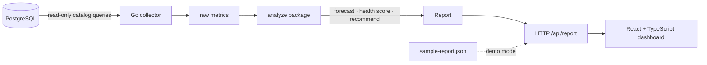

# Architecture

Postgres Atlas is a read-only ops control plane for PostgreSQL. It collects
catalog metrics, runs pure analysis, and surfaces a prioritized remediation plan
with ready-to-run SQL.

## Layers

| Layer | Package | Responsibility |
|-------|---------|----------------|
| Collector | `internal/collector` | Thin, auditable SQL against `pg_stat_*` / `pg_class`. Records daily size into `atlas.size_history`. |
| Analyze | `internal/analyze` | Pure functions: least-squares capacity forecast, health score + letter grade, recommendation engine. Fully unit-tested, no DB. |
| API | `internal/api` | Cached HTTP serving of the report. |
| UI | `frontend/` | Dashboard: score ring, capacity chart, recommendation cards with SQL. |

## Capacity forecast

Daily database size is recorded in `atlas.size_history`. A least-squares line is
fit to the last N days; the slope (bytes/day) and a configured threshold produce
`days_to_threshold` and a projected fill date.

## Health score

Deterministic deductions from a starting score of 100:

| Check | Warn | Critical |
|-------|------|----------|
| Cache hit ratio | &lt; 99% (−8) | &lt; 95% (−18) |
| Connections | ≥ 70% (−8) | ≥ 90% (−16) |
| XID wraparound | ≥ 50% (−12) | ≥ 80% (−30) |
| Dead tuples (worst table) | ≥ 10% (−8) | ≥ 25% (−16) |
| Long-running query | ≥ 300s (−10) | — |

Letter grades: A ≥ 90, B ≥ 80, C ≥ 70, D ≥ 60, else F.

## Recommendations

Rules fire on the analyzed report (capacity runway, wraparound, unused /
duplicate / missing indexes, bloat, vacuum lag, cache hit). Each recommendation
carries a severity and an `action_sql` string for a human to review and run —
**Atlas never executes remediation SQL**.

## Demo vs live

- `--snapshot path.json` serves a precomputed report (zero infrastructure).
- `--dsn postgres://…` introspects a live database.

Both modes produce the same JSON shape, so the dashboard is identical.
